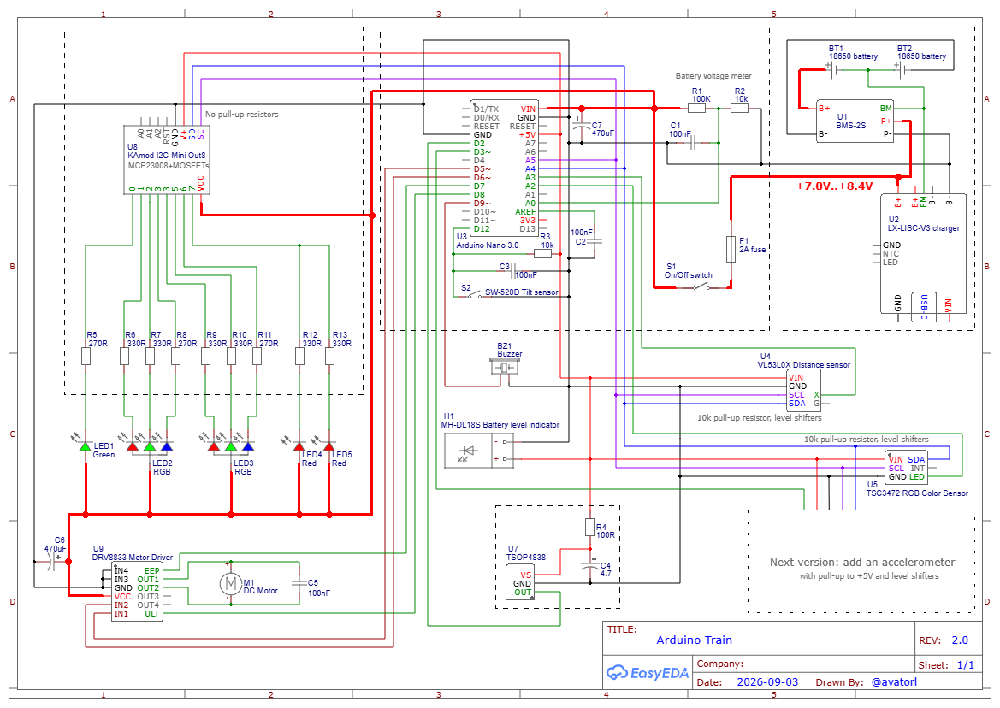

# Arduino DUPLO Locomotive

A 3D-printed DUPLO-compatible locomotive powered by an Arduino Nano. Drive it
with an IR remote, or use automatic obstacle-aware speed control.

## Inside the locomotive

The electronics are packaged inside a 3D-printed DUPLO-compatible locomotive body. The Arduino Nano, motor driver, battery power hardware, sensors, LED wiring, and I2C expander are assembled on compact boards within the chassis.

*Inside of the Arduino locomotive.*

## What it does

- Drives forward and backward at three regular speed levels plus a timed boost.
- Supports manual driving and automatic obstacle-aware driving.
- Shows its status with headlights and rear/status LEDs.
- Plays a horn, siren, melodies, and battery alerts.
- Stops when tipped over and reacts to coloured track markers.
- Monitors the 2S battery pack and sleeps after inactivity until a remote command wakes it.

## What you need

- Arduino Nano-compatible board
- TSOP4838 IR receiver
- DRV8833 motor driver
- DC geared motor, about 3 V to 6 V
- 21-button IR remote
- Passive buzzer
- 2 common-anode RGB LEDs
- 1 green LED
- 2 red LEDs
- 2 x 18650 Li-ion cells
- 2S battery protection module
- 2S USB charger module
- Main power switch
- Fuse
- VL53L0X distance sensor
- SW-520D tilt sensor
- TCS34725 color sensor
- MCP23008 I2C GPIO expander
- LED resistors
- MOSFETs or transistors for custom LED wiring, if needed
- 3D-printed train body and mechanical parts
- Wires, headers, perfboard or PCB, connectors, and mounting hardware

## Safety

This project uses a 2S Li-ion battery pack. Use a protected pack, correct
polarity, a fuse, and suitable wiring. Incorrect battery wiring can damage the
electronics or create a fire risk.
